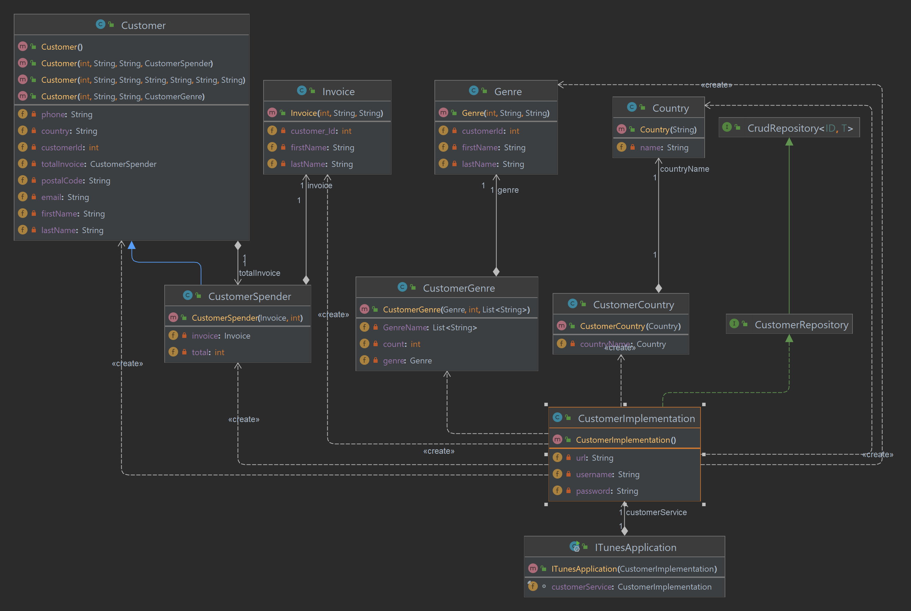

## Assignment Two where we created SQL script and a Spring boot assignment 

In the first part of the assignment we had to do following script

*  Create a script called 01_tableCreate.sql that contains statements to create each of these tables and
   setup their primary keys: Superhero, Assistant, Power

*  Create a script called 02_relationshipSuperheroAssistant.sql that contains statements to ALTER any
   tables needed to add the foreign key and setup the constraint to configure the described relationship between
   Superhero and assistant.

* Create a script called 03_relationshipSuperheroPower.sql that contains statements to create the linking
  table. This script should contain any ALTER statements needed to set up the foreign key constraints between the linking
  tables and the Superhero and Power tables.

*  Create a script called 04_insertSuperheroes.sql that inserts three new superheroes into the database.

*  Create a script called 06_powers.sql that inserts four powers. Then the script needs to give the
   superheroes powers. Try have one superhero with multiple powers and one power that is used by multiple superheroes,
   to demonstrate the many-to-many.

* Create a script called 07_updateSuperhero.sql where you can update a superheroes name. Pick any
  superhero to do this with

*  Create a script called 08_deleteAssistant.sql where you can delete any assistant. You can delete that
   assistant by name (his name must be unique to avoid deleing multiple assistants), this is done to ease working with
   autoincremented numbers – my PC may skip a number or two

The second part of the assignment we ha to manipulate the SQL data with JDBC (PosgreSQL) driver

### class diagram for the setup
